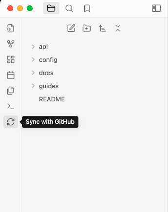

# Obsidian GitHub Sync

Plugin to sync a GitHub repository with an Obsidian vault.

> [!CAUTION]
> This is still in beta.

## Features

These are the main features of the plugin:

- Desktop and mobile support
- Doesn't require `git`
- Multiple vaults sync
- Partial vault sync
- Partial remote repository sync
- Automatic sync on fixed interval
- Manual sync

- Conflicts handling (TODO 🔨)
- Filtering by file type (TODO 🔨)

## Installation

The plugin is still in beta so it's still not available in the community plugins.

For the time being you can install it with BRAT. If you never used BRAT see [the official quick start guide](https://tfthacker.com/brat-quick-guide).

If you already have BRAT installed click [here](obsidian://brat?plugin=https://github.com/silvanocerza/obsidian-github-sync) to install GitHub Sync.

## Usage

### First sync

When starting the plugin for the first time a dialog will guide you through the setup process.

If you already have files in your vault I strongly recommend you to create a new private GitHub repository and sync with that.

> [!NOTE]
> Onboarding is currently not supported on mobile.

### Token

A GitHub Fine-grained token is required to sync with your repository. You can create one by clicking [here](https://github.com/settings/personal-access-tokens/new).
The token must have the `Contents` permission set to `Read and write` like in the screenshow below.

I also suggest creating the token with access only to your sync repo.

### Sync modes

You can always sync manually by clicking the sync button in the side ribbon.
This will always work even if sync on interval is enabled.

If you don't want to see the button you can hide it, just check the plugin settings.

The `Sync with GitHub` command is also available.

### Partial sync

Optionally you can choose to sync only a part of your vault and/or your repository.
This might be useful if you keep the sources for your blog in your vault as example, though you sync with some other service.

> [!WARNING]
> For the time being changing the directories after onboarding is not supported.
> I mean, you can do it, though I have not tested it and it's likely to break in unforeseeable ways.

### Config sync

If you want to sync your vault configs with other vault you can enable that.
It will sync the whole folder, that is `.obsidian` by default, including all plugins and themes.

If you use another sync service it might be best to disable this option.

> [!NOTE]
> The `.obsidian` folder will always be in the root of your repository, even if you choose
> to not sync vault configs. That happens cause the plugin needs to store some metadata to
> correctly sync.

### Reset

I still have to add a reset button to clean the plugin settings and metadata.

For the time being you can reset the plugin by disabling it in the plugins list and deleting the `github-sync-metadata.json`
file in your config directory, `.obsidian` by default.

## License

The project is licensed under the [AGPLv3](https://www.gnu.org/licenses/agpl-3.0.en.html) license.
